# QmrKG：PDF 到知识图谱的端到端 Pipeline

QmrKG 将 **PDF / 演示文稿** 转为 **Markdown**，再 **分块**，经 **大模型抽取三元组**、**合并去重** 后导入 **Neo4j**，并通过 **Next.js 前端**（力导向图）浏览关系网络。各阶段任务通过统一的 **PPIO 兼容 LLM 工厂**（`ocr` / `ner` / `re` / `extract` 等）配置模型与提示词。

## 效果展示

下图是 Pipeline 末端 **「QmrKG 知识图谱展示」** 界面：在深色背景上展示从 Neo4j 读取的采样子图（节点与边数量可在界面中提示），右上角图例区分实体类型（如 Protocol、Concept、Mechanism、Metric）与关系类型；布局由前端力导向算法驱动，便于探索领域概念之间的关联。


## Pipeline 总览

```mermaid
flowchart LR
  PDF[PDF_or_PPT] --> pdftopng[pdftopng]
  pdftopng --> PNG[PNG]
  PNG --> pngtotext[pngtotext]
  pngtotext --> MD[Markdown]
  MD --> mdchunk[mdchunk]
  mdchunk --> Chunks[JSON_chunks]
  Chunks --> kgextract[kgextract]
  kgextract --> Triples[raw_triples]
  Triples --> kgmerge[kgmerge]
  kgmerge --> Merged[merged_triples.json]
  Merged --> kgneo4j[kgneo4j]
  kgneo4j --> Neo4j[(Neo4j)]
  Neo4j --> Web[frontend_graph]
```



## 分阶段说明

| 阶段 | CLI | 典型输入 | 典型输出 |
|------|-----|----------|----------|
| 1. 文档转图 | `pdftopng` | `data/pdf/`（或单文件 `--pdf`） | `data/png/<书名>/` |
| 2. OCR | `pngtotext` | `data/png/` 或单张 `--image` | `data/markdown/` |
| 3. 分块 | `mdchunk` | `data/markdown/` 或 `--markdown` | `data/chunks/` |
| 4. 三元组抽取 | `kgextract` | `data/chunks/` | `data/triples/raw/` |
| 5. 合并去重 | `kgmerge` | `data/triples/raw/` | `data/triples/merged/merged_triples.json` |
| 6. 导入图数据库 | `kgneo4j` | `merged_triples.json` | Neo4j 中的实体与关系 |

查看已注册的子命令：

```bash
uv run qmrkg --list
```

## 项目结构（节选）

```
qmrkg/
├── src/qmrkg/              # Python 包：流水线与各阶段 CLI
│   ├── pipeline.py         # PDFPipeline（PDF → PNG → Markdown）
│   ├── cli_*.py            # pdftopng / pngtotext / mdchunk / kg* 入口
│   ├── kg_extractor.py     # 三元组抽取
│   ├── kg_merger.py        # 合并
│   └── kg_neo4j.py         # Neo4j 导入
├── data/
│   ├── pdf/                # 输入文档
│   ├── png/                # 中间图片（按书籍子目录）
│   ├── markdown/           # OCR 文本
│   ├── chunks/             # 分块 JSON
│   └── triples/
│       ├── raw/            # 每 chunk 原始三元组 JSON
│       └── merged/         # merged_triples.json
├── frontend/               # Next.js 图谱浏览（连接 Neo4j）
├── config.yaml             # 任务级模型与提示词（勿提交密钥）
├── .env.example            # 环境变量模板
└── pyproject.toml
```

## 快速开始

### 1. 安装依赖

```bash
uv sync --extra dev
# 或：uv pip install -e ".[dev]"
```

需要 **Python 3.13**（见 `pyproject.toml`）。

### 2. 配置 API 与密钥

复制 `.env.example` 为 `.env`，填写 **PPIO** 的 API Key（用于 OCR 与抽取等 LLM 调用）：

```dotenv
PPIO_API_KEY=your_api_key_here
```

Neo4j 导入与前端使用 **独立** 的环境变量（见下文「Neo4j 与前端」）。

### 3. 放置 PDF

将 PDF（或支持的演示文稿）放入 `data/pdf/`。

### 4. 按阶段运行（示例）

```bash
# 1) PDF → PNG
uv run pdftopng --pdf-dir data/pdf

# 2) PNG → Markdown（VLM OCR）
uv run pngtotext --image-dir data/png --text-dir data/markdown

# 3) Markdown → JSON chunks
uv run mdchunk --markdown-dir data/markdown --chunk-dir data/chunks

# 4) Chunks → 原始三元组
uv run kgextract --input data/chunks --output-dir data/triples/raw

# 5) 合并去重
uv run kgmerge --input-dir data/triples/raw --output data/triples/merged/merged_triples.json

# 6) 导入 Neo4j（需设置 NEO4J_URI / NEO4J_USER / NEO4J_PASSWORD）
uv run kgneo4j --import data/triples/merged/merged_triples.json
```

常用参数：`pdftopng --dpi`、`pngtotext --recursive`、`kgextract --no-skip` 强制重抽、`kgneo4j --clear` 导入前清空库。使用 `uv run <命令> --help` 查看全部选项。

## Neo4j 与前端可视化

1. 准备可访问的 Neo4j 实例，并用 `kgneo4j` 将合并后的 JSON 导入。
2. 在 `frontend/` 下安装依赖并启动开发服务器：

```bash
cd frontend
pnpm install
pnpm dev
```

3. 在 `frontend/.env.local` 中配置 Neo4j 连接与可选的采样子图规模上限，例如：

```dotenv
NEO4J_URI=bolt://localhost:7687
NEO4J_USER=neo4j
NEO4J_PASSWORD=your_password
NEO4J_GRAPH_NODE_LIMIT=1000
NEO4J_GRAPH_REL_LIMIT=4000
```

浏览器中打开前端即可查看与截图类似的力导向知识图谱界面。

## 配置说明

任务级行为（模型名、`provider`、`prompts`、`request`、`rate_limit` 等）在仓库根目录的 **`config.yaml`** 中按任务分段维护，例如 **`ocr`**（多模态 OCR）、**`ner`**、**`re`**、**`extract`**（三元组抽取）等。请勿在 YAML 中写入 API Key；敏感项放在 **`.env`**。

不要使用已废弃的顶层 **`openai:`** 键，否则配置加载会报错。

### `.env` 常用变量

| 变量 | 说明 |
|------|------|
| `PPIO_API_KEY` | PPIO API Key（必填） |
| `PPIO_BASE_URL` | 覆盖各任务 `provider.base_url` |
| `PPIO_MODEL` | 覆盖当前任务所用模型 |
| `NEO4J_URI` / `NEO4J_USER` / `NEO4J_PASSWORD` | Neo4j 连接（`kgneo4j` 与前端） |

### 可选环境变量覆盖（与 `config.yaml` 对应）

| 环境变量 | 作用 |
|----------|------|
| `PPIO_PROMPT` / `PPIO_PROMPT_KEY` | 覆盖或选择 prompt |
| `PPIO_VLM_MODEL` / `PPIO_VLM_PROMPT` | 针对 OCR 段 |
| `PPIO_IMAGE_DETAIL` | 多模态图像 detail |
| `PPIO_RPM` / `PPIO_MAX_CONCURRENCY` | 速率与并发 |
| `PPIO_TIMEOUT_SECONDS` / `PPIO_MAX_RETRIES` | 请求超时与重试 |

## Python API（节选）

完整流水线（至 Markdown）：

```python
from pathlib import Path
from qmrkg import PDFPipeline

pipeline = PDFPipeline(
    pdf_dir=Path("data/pdf"),
    image_dir=Path("data/png"),
    text_dir=Path("data/markdown"),
    dpi=200,
)

results = pipeline.process_all()
# 或：pipeline.process_pdf(Path("data/pdf/example.pdf"))
```

分步与通用文本任务示例：

```python
from qmrkg import PDFConverter, OCRProcessor, TextTaskProcessor

converter = PDFConverter(dpi=200)
image_paths = converter.convert("document.pdf")

ocr = OCRProcessor(lang="ch")
text = ocr.extract_text("page_1.png")

ner = TextTaskProcessor("ner")
response = ner.run_text("从这段文本中抽取关键实体：张三于2024年加入派欧云。")
print(response.text)
```

后续分块、抽取、合并、入库请使用上述 CLI 或直接使用 `KGExtractor`、`KGMerger`、`KGNeo4jLoader` 等类（见 `src/qmrkg/`）。

## OCR 输出格式

生成的 Markdown 可按页分段，例如：

```
--- Page 1 ---
第一页识别出的文字内容...

--- Page 2 ---
第二页识别出的文字内容...
```

## 常见问题

**Q: API 调用失败？**  
A: 检查 `.env` 中 `PPIO_API_KEY` 与网络是否可访问 PPIO。

**Q: OCR 不清晰？**  
A: 提高 `pdftopng` 的 `--dpi`（如 300～400），或调整 `config.yaml` 中 `ocr.prompts`。

**Q: 如何限流？**  
A: 在 `config.yaml` 各任务的 `rate_limit` 中调整 `rpm` 与 `max_concurrency`。

**Q: reasoning 模型的 thinking 如何开关？**  
A: 在对应任务段设置 `provider.supports_thinking: true`，再用 `request.thinking.enabled` 控制。

## License

MIT License
